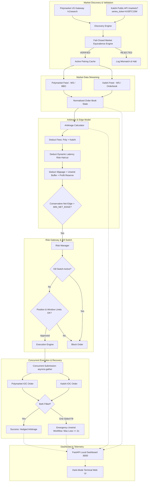

# Production Polymarket US & Kalshi BTC 15-Minute Arbitrage Bot

A high-performance, deterministic, fail-closed cross-exchange arbitrage system designed for trading Bitcoin (BTC) 15-minute event contracts between **Polymarket US (`polymarket.us`)** and **Kalshi (`kalshi.com`)**.

---

## 1. System Architecture



---

## 2. Core Safety & Architectural Principles

### I. Deterministic Market Equivalence Engine
Arbitrage between prediction markets is economically valid only when the two contracts represent the **exact same underlying economic event and settlement conditions**.
The bot enforces an uncompromising, fail-closed multi-point verification function (`are_markets_equivalent`):
- **Underlying Asset:** Must be strictly Bitcoin (`BTC`). Structurally rejects any S&P 500 (`SPX`, `INX`, `500`), Ethereum (`ETH`), Solana (`SOL`), or non-BTC contract.
- **Time Windows:** Start and end timestamps must align to the exact second (tolerance: 0 seconds).
- **Duration:** Must be exactly 900 seconds (15 minutes).
- **Oracle / Settlement Index:** Both venues must settle using **CF Benchmarks Bitcoin Real-Time Index (`BRTI`)** 60-second sampling.
- **Reference / Strike Price:** `priceToBeat` (Polymarket) and `floor_strike` (Kalshi) must match within tolerance.
- **Payout:** Contract payout on win must be exactly $1.00 USD on both venues.

### II. Positive-EV & Conservative Edge Haircut
The bot never trades on raw display prices. It evaluates the executable edge by deducting all documented and modeled execution costs:
$$\text{Conservative Net Edge} = \text{Payout (\$1.00)} - (\text{YES}_{\text{ask}} + \text{NO}_{\text{ask}}) - \text{Fees}_{\text{total}} - \text{Slippage} - \text{Latency Haircut} - \text{Unwind Risk} - \text{Profit Reserve}$$
- **Kalshi Fee:** Parabolic formula $\lceil 0.07 \times C \times P \times (1 - P) \rceil$ rounded up to the nearest cent.
- **Polymarket Fee:** Dynamic fee coefficient ($0.0695$).
- **Dynamic Latency Haircut:** Continuously adjusted based on measured rolling p95 latency.
- Orders are only routed when $\text{Conservative Net Edge} \ge \text{MIN\_NET\_EDGE}$.

### III. Concurrent Leg Execution & One-Sided Fill Recovery
- Both legs are dispatched simultaneously using `asyncio.gather` on a single high-performance event loop.
- **One-Sided Fill Manager:** If Leg 1 fills while Leg 2 is rejected/unfilled:
  1. Any open order for Leg 2 is immediately cancelled.
  2. The missing hedge is attempted if still available within safe limits.
  3. If unavailable, the filled leg is liquidated immediately via native emergency close mechanisms within `MAX_ORPHAN_EXIT_LOSS` ($0.02). The bot never carries an unintended directional position.

### IV. Three-Tier Operating Modes
1. **DATA MODE (`--data`):** Read-only mode. Connects to public discovery and market data feeds, performs equivalence checks, but never executes orders.
2. **PAPER MODE (`--paper`, Default):** Simulates realistic fills, slippage, and latency against live market data feeds. Zero real capital at risk.
3. **LIVE MODE (`--live`):** Submits real orders using authenticated credentials. **Disabled by default.** Requires passing preflight checks and explicit manual confirmation.

---

## 3. Directory Layout

```
BTC15ARB/
├── app/
│   ├── __init__.py
│   ├── config.py              # Pydantic BaseSettings & environment loader
│   ├── models.py              # Domain schemas & Decimal financial types
│   ├── fees.py                # Deterministic fee schedules (Kalshi & Polymarket)
│   ├── latency.py             # Nanosecond latency telemetry & dynamic haircuts
│   ├── market_matcher.py      # Fail-closed market equivalence & anti-confusion
│   ├── market_discovery.py    # Automated continuous discovery of 15m intervals
│   ├── arbitrage.py           # Conservative edge calculation & risk buffers
│   ├── risk.py                # Global kill switch, position limits, deduplication
│   ├── execution.py           # Concurrent order submission & orphan unwind
│   ├── portfolio.py           # Cross-exchange positions & balance accounting
│   ├── persistence.py         # SQLite persistence for trades, audits, and rejections
│   ├── exchanges/
│   │   ├── polymarket_us.py   # Async Polymarket US client (Ed25519 signing)
│   │   └── kalshi.py          # Async Kalshi client (RSA-PSS SHA-256 signing)
│   ├── feeds/
│   │   ├── polymarket_ws.py   # Polymarket WebSocket & high-frequency BBO fallback
│   │   └── kalshi_ws.py       # Kalshi WebSocket & orderbook delta stream
│   └── dashboard/
│       ├── api.py             # FastAPI REST endpoints & live controls
│       ├── state.py           # Shared dashboard state singleton
│       └── frontend/
│           └── index.html     # Dark-mode financial terminal UI
├── docs/
│   └── API_VERIFICATION.md    # Verified endpoints, schemas, and fee documentation
├── scripts/
│   ├── preflight_checks.py    # Mandatory preflight verification suite
│   └── benchmark.py           # Microsecond latency benchmarking tool
├── tests/
│   ├── test_market_matcher.py # Market equivalence & S&P 500 rejection tests
│   ├── test_arbitrage.py      # Positive, zero, negative edge & haircut tests
│   ├── test_execution.py      # Concurrent submission & one-sided fill recovery
│   ├── test_risk_safety.py    # Kill switch, limits, and deduplication tests
│   ├── test_fees.py           # Parabolic fee schedule tests
│   └── test_decimal_precision.py # Decimal vs float drift verification tests
├── .env.example               # Credential configuration template
├── requirements.txt           # Dependency specifications
├── run.py                     # CLI launcher
└── README.md
```

---

## 4. Setup & Quickstart

### 1. Installation
```powershell
python -m pip install -r requirements.txt
```

### 2. Run Mandatory Preflight Checks
Before starting the bot, run the preflight verification suite:
```powershell
python scripts/preflight_checks.py
```
This tests:
- Decimal financial precision
- Parabolic fee models
- Anti-confusion S&P 500 structural rejection
- Live market discovery and BRTI oracle equivalence
- Global emergency kill switch

### 3. Run Latency Benchmarks
Benchmark the critical execution path on your machine:
```powershell
python scripts/benchmark.py
```
*Hot path decision + risk validation executes in ~20 microseconds (0.02 ms).*

### 4. Run Comprehensive Test Suite
```powershell
python -m pytest -v
```
*All 23 comprehensive tests covering matching, execution, one-sided fill recovery, risk, and fees.*

---

## 5. Running the Bot

### Start in Paper Simulation Mode (Default & Safe)
```powershell
python run.py
```
Once started, open the local web dashboard:
**`http://127.0.0.1:8000`**

The dashboard displays:
- Real-time `MARKET MATCH: VERIFIED` banner with underlying, oracle, and strike details.
- Live order books from both Polymarket US and Kalshi.
- Arbitrage opportunity panel with complete edge decomposition.
- Emergency Kill Switch and Live Trading confirmation modal.
- Executed trades and rejected opportunities history.

### Start in Read-Only Data Mode
```powershell
python run.py --data
```

---

## 6. Live Trading Credentials & Activation

To enable LIVE trading with real capital:
1. Configure credentials in `.env`:
   - Polymarket US: `POLYMARKET_US_KEY_ID`, `POLYMARKET_US_SECRET_KEY`
   - Kalshi: `KALSHI_API_KEY_ID`, `KALSHI_PRIVATE_KEY_PEM` (or `KALSHI_PRIVATE_KEY_PATH`)
2. Run `python scripts/preflight_checks.py` to confirm credentials and account access.
3. Start the bot (`python run.py`).
4. In the dashboard at `http://127.0.0.1:8000`, click **LIVE TRADING: OFF** and complete the two-step confirmation.
